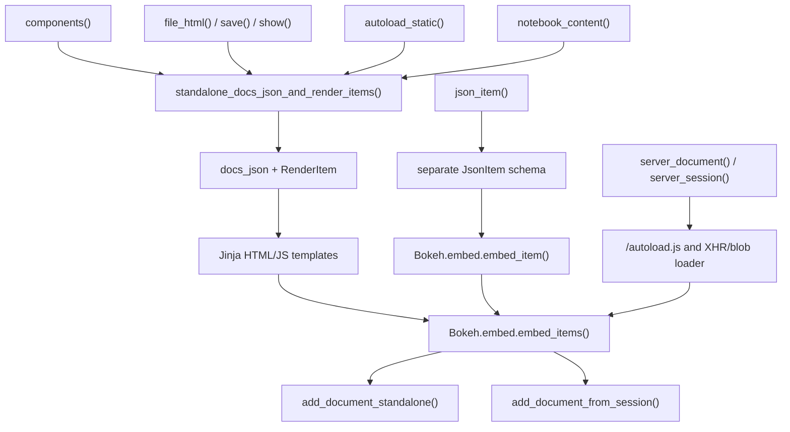
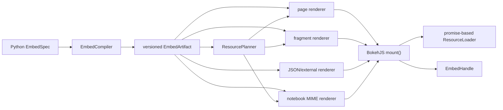

# A coherent embedding architecture for Bokeh

Status: proposal.

Scope reviewed: the current `branch-3.10` implementation (reporting Bokeh `4.0.0.dev1`), the `minimal-ids` work, the Python and BokehJS embedding tests, the Sphinx `bokeh-plot` extension, and relevant open issues and history through 2026-08-20.

## Executive recommendation

Bokeh should have one embedding compiler, one versioned embedding artifact, one resource planner, and one browser mounting API. It should continue to offer several output renderers because a complete HTML page, a template fragment, an AJAX response, a static external payload, a notebook MIME bundle, and a server session are genuinely different delivery forms.

The important unification is therefore below those forms:

1. Python normalizes a standalone model/document or server source into an `EmbedSpec`.
2. One compiler produces an immutable `EmbedArtifact` containing the serialized source, logical roots, exact dependency requirements, and metadata.
3. Small renderers turn that artifact into a page, fragment, JSON response, external reference, or notebook MIME bundle.
4. One BokehJS `mount()` path accepts the artifact, resolves actual DOM elements, ensures resources, and returns an `EmbedHandle` with readiness, errors, and disposal.
5. Useful familiar APIs delegate to that pipeline; obsolete wire shapes and control flags are removed at the Bokeh 4.0 boundary or fail with an explicit migration error.

The `minimal-ids` work should land as part of this foundation. Standalone artifacts should preserve IDs only for models whose identity cannot be reconstructed structurally, such as shared or cyclic models, and for other protocol-visible references. Artifact roots are addressed by logical key plus document/root ordinal, so DOM mounting does not force model IDs or generated element IDs.

The Sphinx directive should be the first major consumer of the new pipeline. A docs page should contain one bootstrap, at most one copy of each actually required BokehJS bundle, and one page-level payload. It should not generate one autoload program per plot.

This is not just API tidying. The current behavior contains observable defects and long-standing gaps:

- `autoload_static()` includes all five standard BokehJS bundles even for a plain line plot.
- A 2020 attempt to prune those bundles was reverted because the global autoload loader cannot add a widget bundle reliably after a core-only embed starts loading.
- `json_item()` permanently clears the title of a single-root document.
- `server_session(model=...)` produces the same output as `server_session(None, ...)`; the documented model selection is currently unused.
- `autoload_static(Document)` creates mappings for every root but emits a target for only the first, so a multi-root document cannot resolve all of its targets.
- The BokehJS tests barely exercise `embed_item()` or `embed_items()`, and there are no focused tests for the `bokeh-plot` directive itself.
- Browser-side failures are mostly console output. Callers have no uniform error callback and no reliable way to dispose of a standalone document or close an embedded server session.

## Goals

- Preserve every currently supported embedding use case.
- Make the common path obvious for new users while retaining expert control.
- Give Python, BokehJS, notebooks, Bokeh server, and documentation builds the same artifact contract.
- Load exactly the required resources, once, even when embeds arrive concurrently or incrementally.
- Support multiple roots and arbitrary framework-owned DOM targets without private APIs.
- Surface readiness, errors, and cleanup through a stable lifecycle object.
- Make static builds reproducible and cacheable.
- Make strict resource, CSP, SRI, cross-origin, reverse-proxy, and extension behavior testable rather than template folklore.
- Use the Bokeh 4.0 breaking-release boundary to remove machinery that would distort the new design while providing a documented route for every old use case.

## Non-goals

- A single function with a `format="components|json|autoload|..."` switch. That would move the hodge-podge into a string argument rather than remove it.
- Removing the Bokeh server protocol or making Python callbacks work in standalone output.
- Requiring a complete BokehJS ESM/package split before improving embedding. The first loader can manage the existing bundles; ESM can become another resource backend later.
- Preserving every legacy API, wire envelope, return-shape flag, or byte-for-byte HTML/JavaScript form. Use-case coverage and clear migration are the targets.

## Current architecture

The implementation is more unified internally than the public surface suggests, but the shared layer is the wrong abstraction. Most paths eventually manufacture `docs_json` plus `RenderItem`, then use Jinja templates to call `Bokeh.embed.embed_items()`. Resource selection, DOM targeting, loading, and lifecycle remain scattered around that core.



`RenderItem` is simultaneously an internal Python rendering instruction, a JSON wire representation, a DOM lookup plan, and a discriminator between standalone documents and server tokens. This is the main knot to undo.

## Complete current use-case and API inventory

The table includes public embedding APIs, user-facing I/O wrappers, internal-but-important paths, and browser APIs. “Partial” means that the implementation exposes some machinery but not a coherent supported API.

| Current use case | Current APIs | Overlap or limitation | Proposed mapping |
|---|---|---|---|
| Return a complete standalone HTML page as a string | `bokeh.embed.file_html()` | Owns serialization, resource planning, template rendering, title, and callback warning behavior | `embed(obj).page(...)`; legacy `file_html()` delegates |
| Save standalone HTML to disk | `bokeh.io.save()`; `output_file()` supplies defaults | Thin stateful wrapper over `file_html()` | Keep `save()`; route its final render through `EmbedArtifact.page()` |
| Save and open standalone HTML in a browser | `bokeh.io.show()` with file output or its default fallback | Overlaps `save()` and `file_html()` and adds global output state | Keep `show()` as an I/O convenience over the same page renderer |
| Insert one standalone plot into an existing template | `components()` | Returns executable script plus a generated `<div>`; assumes standard resources are already loaded | `embed(plot).fragment(resources="none")`; legacy tuple wrapper remains |
| Insert multiple or named roots in separate template locations | `components(sequence|mapping)`; `RenderRoot`; custom `file_html()` template and `embed()` macro | Input/output shape is convenient, but target IDs, script, and document data are coupled | One artifact with logical root keys; mount keys map to caller-owned elements |
| Fetch standalone plot data from a web endpoint | `json_item()` plus `Bokeh.embed.embed_item()` | Single model only; target is embedded in data; no dependency metadata; separate schema | `embed(plot).to_json()` plus `mount(artifact, {targets})`; remove the `JsonItem` envelope and provide a 4.0 migration error/recipe rather than maintaining two schemas |
| Host plot data externally and place one self-loading tag in HTML | `autoload_static()` | Returns JavaScript to save plus a tag; all bundles; race-prone global loader; multi-root broken | Declarative external artifact reference plus one shared bootstrap; remove the per-artifact JavaScript generator in 4.0 |
| Generate a new Bokeh server session for each page load | `server_document()` | Produces inline XHR that turns JavaScript into a blob; errors are not surfaced to caller | `embed_server(url).fragment()` using a JSON bootstrap endpoint and common `mount()` |
| Embed an existing Bokeh server session | `pull_session()` plus `server_session(session_id=...)` | Separate API despite almost identical output; session reuse hazards | `embed_server(url, session_id=...)`; same artifact/source variant and same handle |
| Select one model/root from an existing server session | Documented `server_session(model=...)` | Not actually implemented: `modelid` is passed to a template that does not use it | Explicit `roots={key: model_id}` in the server spec; add end-to-end tests |
| Render a Bokeh server app at its own URL | Server doc handlers plus internal `server_html_page_for_session()` | Uses the same templates but bypasses public constructors | Server creates a server-source artifact and feeds the normal page renderer |
| Standalone output in Jupyter | `output_notebook()`, `show()`, internal `load_notebook()`, `notebook_content()` | Separate autoload and document templates; all bundles loaded up front | Artifact MIME renderer plus the same loader and mount runtime |
| Incrementally update a standalone notebook output | `show(..., notebook_handle=True)` and `push_notebook()` | Comms target is bolted onto `RenderItem`; lifecycle is notebook-specific | `EmbedHandle` owns the document plus an optional transport; notebook adapter supplies comms |
| Run a Bokeh server application in a notebook | `show(Application|callable)`, internal `show_app()`, local `Server`, then `server_document(resources=None)` | A second server embedding path layered onto notebook MIME hooks | Server-source artifact rendered as notebook MIME; same readiness/error/dispose contract |
| Mount already-created BokehJS models/documents | `Bokeh.Plotting.show()`, `add_document_standalone()` | High-level plotting creates documents implicitly; lower-level function is not a complete lifecycle API | Public programmatic `mount(document|artifact, targets)` returning `EmbedHandle` |
| Mount raw standalone docs and root mappings in JavaScript | `Bokeh.embed.embed_items()` | Exposes Python's internal `RenderItem` wire shape; mixes standalone and server cases | Accept the versioned artifact schema in `mount()`; reject raw `RenderItem` input with 4.0 migration guidance unless a decoder proves trivial and isolated |
| Mount a single legacy JSON item | `Bokeh.embed.embed_item()` | Repackages its input into random `docid` plus `RenderItem`; target typing disagrees with Python `None` | Use `mount()` with `EmbedArtifact`; do not require a permanent `JsonItem` adapter |
| Pull and mount a server session directly in JavaScript | `add_document_from_session()`; partially `embed_items()` | No idiomatic documented server constructor, selective roots, or caller error/lifecycle API | `mount(serverArtifact, options)` or an equivalent public JS constructor |
| Embed different roots into React/Vue/Angular-owned locations | Possible through low-level `RenderItem`/root arrays, but not an idiomatic supported API | Long-standing open request; global view index and document ownership complicate teardown | Direct `HTMLElement`, `ShadowRoot`/fragment where supportable, or selector targets; handle-controlled lifecycle |
| Build static documentation and galleries | `bokeh-plot` directive calls `autoload_static()` once per plot | One generated JS file and full loader per plot; global monkeypatching; exactly one root; UUID filenames | Page collector emits mount nodes, one page artifact, exact page dependency union, and one bootstrap |
| Use custom templates | `file_html(template=...)` and legacy Jinja context/macros | A string means template source, not a path; contract is broad and weakly typed | Typed page/fragment result plus documented template context; accept `Path` distinctly from source text |
| Choose CDN, inline, server, relative, or absolute resources | `Resources`; some APIs take `ResourcesLike`, some require `Resources`, some accept only `"default"|None` | Resource location and required component discovery are conflated; ownership differs by API | `ResourcePolicy` selects location; compiler emits location-independent requirements; planner resolves assets |
| Suppress resources because the host page owns them | `components()` implicitly; `server_document(resources=None)` explicitly; manual resources for `json_item()` | Three different conventions | Consistent `resources="none"` render policy, while artifact still declares requirements |
| Cross-origin, credentialed, header-bearing, argument-bearing, or reverse-proxied server embeds | `server_document()` and `server_session()` options | URL strings are hand-assembled; header/credential behavior lives in an inline template | Structured server request options consumed by one fetch/session bootstrap with explicit error results |
| Bundle custom extensions and external JS/CSS | `Bundle`, `Resources`, `_bundle_extensions()`, model `__javascript__`/`__css__` | Some collection scans selected objects, some scans every registered model class, and server/notebook often use all | Explicit per-model/package dependency declarations in the resource requirement manifest |

## Why the current system is fragile

### 1. Resource ownership changes from API to API

- `file_html()` knows the object graph and prunes standard bundles.
- `components()` declares that the caller owns BokehJS resources, but can still inject compiled custom model code into its returned script.
- `json_item()` declares no resource requirements at all.
- `autoload_static()`, server autoload, and notebook loading call the bundler with `objs=None`, which deliberately selects widgets, tables, WebGL, and MathJax.
- `Resources.js_files` also collects external resources from every registered model class, while extension bundling elsewhere can inspect selected objects.

A portable plot artifact must say what it needs independently of where those assets will come from.

### 2. The autoload loader is a global race, not a resource manager

Every generated autoload program coordinates through `_bokeh_onload_callbacks` and `_bokeh_is_loading`. It tracks only a count, not which URLs or capabilities are loading or loaded. It cannot safely merge later requirements into an in-flight load.

This is a known regression path, not a hypothetical one. PR [#10292](https://github.com/bokeh/bokeh/pull/10292) changed autoload to select only necessary bundles. It was reverted by [#10385](https://github.com/bokeh/bokeh/pull/10385) after [#10361](https://github.com/bokeh/bokeh/issues/10361) showed that a widget embed fails when an earlier embed on the page requested core only. The still-open [#10166](https://github.com/bokeh/bokeh/issues/10166) records the original docs/gallery bundle-pruning problem.

The right fix is a promise registry keyed by normalized resource identity, with additive dependency resolution and explicit states (`unrequested`, `loading`, `loaded`, `failed`). Making `autoload_static()` pass its models again without replacing the loader would recreate the 2020 bug.

### 3. Delivery format is mixed with DOM placement

Current standalone serialization produces random document IDs, random JSON-script IDs, model IDs, and random element IDs. `RenderItem` maps model IDs to element IDs. `json_item()` has another `target_id`. Autoload relies on replacing its own `<script id=...>` with a `<div>`.

These are separate concerns:

- model identity belongs to the document graph;
- logical root identity belongs to the artifact contract;
- actual DOM targets belong to a specific mount operation;
- static asset identity belongs to the build system.

Keeping them separate removes most generated DOM IDs and makes React/Vue/Sphinx integration much simpler.

### 4. There is no common browser lifecycle

The browser functions return `ViewManager` in some paths, `void` in notebook paths, or nothing usable from generated script tags. Server sessions are cached globally. Errors may be logged or swallowed outside development mode. There is no stable, uniform way to:

- await resource and document readiness;
- distinguish resource, decode, target, HTTP, WebSocket, and render errors;
- attach an error UI;
- remove all views and document registrations;
- close and evict a server session;
- mount additional roots from the same document later.

The needs are already represented by open issues for [error reporting](https://github.com/bokeh/bokeh/issues/10261), [session/document disposal](https://github.com/bokeh/bokeh/issues/9026), [server embedding from JavaScript](https://github.com/bokeh/bokeh/issues/10152), and [separate roots in framework applications](https://github.com/bokeh/bokeh/issues/8499).

### 5. Similar entry points have drifted semantically

Concrete examples from the current code:

- `json_item()` sets `doc.title = ""` inside `OutputDocumentFor`. When the model is the complete root set of an existing document, the context uses that document and never restores its title.
- `server_session()` computes `modelid`, but `autoload_request_tag.html.jinja` never consumes it. A selected model and `None` generate identical output when the generated target ID is held constant.
- `autoload_static()` accepts `Document`; it creates a target mapping for every root, then takes only the first target ID for its single tag. BokehJS subsequently tries to resolve every mapped root target.
- `components()` runtime validation accepts `Document`, but the downstream `OutputDocumentFor` path requires models, so the apparent support does not work coherently.
- Several involved classes/functions use mutable list or dict defaults, increasing the chance of state leakage as the code evolves.
- Full-page output contributes base page CSS and normal resource tags; `json_item()` users must reconstruct the right environmental styling themselves, which contributes to output-form differences such as [#15155](https://github.com/bokeh/bokeh/issues/15155).

Retained facades should receive focused fixes where they remain useful. Removed APIs instead need migration tests that prove the replacement covers the use case without recreating the old machinery.

### 6. The wire contracts are implicit and order-sensitive

`JsonItem`, `DocsJson`, and `RenderItem` have no independent schema version. `JsonItem.version` duplicates the document's Bokeh version, but does not version the embedding envelope. BokehJS accepts Python internal shapes directly. Issue [#13115](https://github.com/bokeh/bokeh/issues/13115) demonstrates that semantically equivalent JSON can fail when object keys are reordered.

An embedding artifact needs its own schema identifier, validation, compatibility rules, and cross-language fixtures. Document deserialization itself must be insensitive to object key order and forward references.

## Proposed architecture



### 1. `EmbedSpec`: normalized intent

`EmbedSpec` is a Python-only typed structure. It records:

- source: standalone model(s)/document(s), new server session, or existing server session;
- ordered logical roots, optionally supplied as a mapping;
- theme and standalone callback policy;
- server request/session options where applicable;
- title behavior and metadata;
- serialization policy (`static` or `protocol`) and future compression settings.

It must not contain generated DOM IDs or already-rendered HTML.

The public constructor names are provisional, but the API should look like this rather than a format switch:

```python
from bokeh.embed import embed, embed_server

plot_embed = embed(plot)
dashboard_embed = embed({"summary": summary, "detail": detail})
app_embed = embed_server(
    "https://example.test/app",
    arguments={"account": "123"},
)
session_embed = embed_server(
    "https://example.test/app",
    session_id=session.id,
    roots={"detail": detail.id},
)
```

Both constructors compile to the same kind of artifact and expose the same output renderers.

### 2. `EmbedArtifact`: one portable contract

The compiled artifact is immutable and JSON-compatible. A representative shape is:

```json
{
  "schema": "bokeh.embed/v1",
  "bokeh_version": "4.1.0",
  "source": {
    "kind": "standalone",
    "document": {"version": "4.1.0", "title": "", "roots": []}
  },
  "roots": [
    {"key": "summary", "document": 0, "root": 0},
    {"key": "detail", "document": 0, "root": 1}
  ],
  "requires": {
    "components": ["bokeh/core", "bokeh/widgets"],
    "extensions": []
  },
  "metadata": {}
}
```

The exact spelling can change, but these rules should not:

- `schema` versions the envelope independently of the Bokeh document protocol.
- `source.kind` is explicit. The browser no longer guesses standalone versus server from `docid` versus `token` fields.
- roots have stable artifact-local keys. A target element is supplied at mount time and is not part of a reusable data payload by default.
- dependency requirements are location-independent. CDN/server/inline URL resolution happens when rendering or mounting.
- standalone binary data is serialized inline; separate binary buffers remain a protocol-message concern and are not part of `bokeh.embed/v1`. Compression would require a future schema extension.
- unknown optional fields are ignored according to documented schema rules; unsupported schema majors fail before partial rendering.

An artifact may internally contain more than one document to preserve existing `file_html()` and mixed-document behavior, but most public constructors should produce one document. The schema should make multiple documents explicit rather than recreate random `docid` indirection for the common case.

### 3. Minimal and separated IDs

The `minimal-ids` branch already has the essential graph analysis:

- anonymous models can deserialize with a newly allocated client-side ID;
- shared and cyclic models retain IDs;
- standalone embedding adds mounted roots to `extra_models_with_ids`.

That policy should become the embedding compiler's default. It should be applied consistently to `components`, JSON, autoload, full pages, notebooks, and docs artifacts, not just selected standalone helpers.

The compiler should define the externally referenced set explicitly. At minimum it includes:

- models referenced more than once or in cycles, as found by the minimal-ID analysis;
- models whose IDs are used by a supported patch/comms/server protocol boundary.

The normal artifact root table is structural: logical key plus document/root ordinal. A root belongs in the externally referenced ID set only when a separate compatibility or live protocol explicitly addresses it by model ID.

Separately:

- mount elements should use `data-bokeh-root="summary"` or direct `HTMLElement` references, not generated IDs;
- the artifact should not need a random document envelope ID when it contains one document;
- the JSON `<script>` element, if used, can be found relative to the fragment or by a caller-supplied ID;
- docs asset filenames should derive from source/options/Bokeh-version fingerprints, not serialized model IDs or UUIDs.

This preserves the minimal-ID work without making deterministic docs caching depend on the stability of every model ID.

### 4. Resource requirements and resource policy are different objects

The compiler emits `ResourceRequirements`; a `ResourcePolicy` resolves them.

`ResourceRequirements` should describe capabilities such as:

- `bokeh/core`;
- `bokeh/widgets`;
- `bokeh/tables`;
- `bokeh/webgl`;
- `bokeh/mathjax`;
- BokehJS API, if explicitly requested;
- custom extension modules, styles, and external dependencies.

`ResourcePolicy` should describe delivery:

- CDN, inline, Bokeh server, relative, absolute, or host-owned/none;
- version and minification;
- base URL or filesystem root;
- SRI and `crossorigin` policy;
- CSP nonce or external-only requirements;
- preload/module behavior.

Initially, the planner can adapt the existing `_use_widgets`, `_use_tables`, `_use_gl`, and `_use_mathjax` checks. The target should be declarative metadata on model classes and extension manifests, so dependency discovery does not rely on a growing set of Python `isinstance` scans or the global model-class registry.

Custom extensions must declare dependencies in `bokeh.ext.json` or package metadata. Legacy `__javascript__`, `__css__`, and implementation compilation remain fallback adapters during migration.

### 5. Output renderers

One artifact supports a small, orthogonal set of renderers:

| Renderer | Result | Primary use |
|---|---|---|
| `artifact.page(...)` | Complete HTML string | `file_html`, `save`, browser output, direct server page |
| `artifact.fragment(...)` | Typed fragment containing mount HTML, declarative artifact data/reference, and optionally resolved resources | Jinja/Django/Flask templates, CMS output |
| `artifact.to_json()` | Data-only envelope | AJAX/fetch, APIs, storage |
| `artifact.external(payload_url=...)` | Declarative mount/reference HTML; payload saved or served separately | Static sites and replacement for autoload |
| `artifact._repr_mimebundle_()` or notebook adapter | MIME bundle | Jupyter and other notebook hooks |

A fragment result should be a dataclass, not an overloaded tuple, for example:

```python
fragment = embed(plot).fragment(resources="none")

fragment.html
fragment.requirements
fragment.artifact
```

Convenience accessors can make simple templates concise. The legacy `components()` wrapper can still return `(script, divs)` while internally consuming the typed result.

The new external form should reference data, not generate a unique self-contained JavaScript program. One shared bootstrap scans or is explicitly given mount declarations and fetches artifacts.

### 6. One BokehJS mounting and lifecycle API

The supported browser API should be programmatic first:

```javascript
const handle = Bokeh.embed.mount(artifact, {
  targets: {
    summary: document.querySelector("#summary"),
    detail: document.querySelector("#detail"),
  },
  resources: "auto",
  onError(error) {
    showEmbeddingError(error)
  },
})

await handle.ready

// Later, including from a React/Vue unmount hook:
await handle.dispose()
```

`mount()` should accept direct elements as the primary form, with IDs/selectors as conveniences. It should support all roots at once and, where the document model allows it, mounting an additional root later through the same handle. It should never expose the Python `RenderItem` structure as its primary API.

`BokehMount` provides:

- `ready: Promise<void>`;
- the deserialized `Document`;
- root-key-to-model/view accessors;
- the server `ClientSession`, when present, through a documented interface;
- structured error events or callback;
- idempotent `dispose()` that removes views, unpublishes target-local handles, closes/evicts server sessions, and releases listeners;
- an optional state/status useful for notebook and framework integrations.

The final Bokeh 4 boundary removes `Bokeh.index`, `Bokeh.documents`, and a
public global view manager. Callers retain the handle, read
`target.bokehMount`, or await `Bokeh.when_mounted(target, {signal})`. They use
logical root keys, `mount.view_lookup`, semantic `Model.name`, and explicit
`CustomJS.args` rather than global model-ID rediscovery.

### 7. A real resource loader

The loader may live in a small bootstrap package so that it can load Bokeh core itself. Whether the public name is `BokehLoader` or an ESM import is secondary. Its contract is:

- `ensure(requirements, policy) -> Promise<ResolvedRuntime>`;
- deduplicate by normalized URL, version, type, integrity, and relevant attributes;
- merge requirements from embeds that arrive before, during, or after other loads;
- respect dependency order while allowing independent assets to load concurrently;
- expose load failures and failed URLs;
- detect an incompatible already-loaded BokehJS version instead of silently continuing;
- attach SRI, `crossorigin`, nonce, and module/classic attributes correctly;
- avoid reloading assets that another Bokeh embed already loaded;
- support retry only through an explicit policy.

The critical regression test is sequential and concurrent additive loading: a core-only plot followed by a widget plot must always work, regardless of timing and cache state.

### 8. Server source as an artifact variant

The current `/autoload.js` endpoint should gain a JSON counterpart, e.g. an embed-bootstrap endpoint that returns a server-source artifact or the session token plus requirements. The exact URL is an implementation choice.

This removes the XHR-to-blob-to-script chain from the primary path. It also permits normal `fetch()` status handling, typed authentication errors, and a clean server `EmbedHandle`.

Server artifacts/options need to cover all existing behavior:

- new versus existing session;
- request arguments;
- headers or credentials with their current mutual-exclusion rule where necessary;
- relative and absolute/reverse-proxy URL resolution;
- suppressing resource delivery when the host owns it;
- whole document or explicit root mapping;
- same-origin and allowed cross-origin behavior;
- signed tokens and existing security constraints.

The server knows the initial session document and can report its exact initial requirements. Because a server application can add new model types later, the runtime also needs an additive resource mechanism. In the short term, server policy may conservatively include standard dynamic bundles while standalone/docs artifacts are exact. In the target state, protocol messages that introduce a not-yet-registered model should be preceded by or carry a resource requirement update.

### EMBED 04 implementation record

The initial implementation resolves several choices left open above:

- standalone inputs are normalized into exactly one compiler document and use
  EMBED 03's graph-minimal `Document.to_static_json()` seam; independent
  documents become independent artifacts;
- every rendered artifact requires `bokeh/api` because the established
  `Bokeh.mount()`/`BokehMount` lifecycle lives in that bundle; core artifact
  decoding does not import the API bundle across bundle boundaries;
- allocation-dependent retained graph IDs are structurally normalized for the
  artifact fingerprint, while resource policy and renderer options contribute
  to a separate typed-output build fingerprint;
- page/fragment resource policies resolve assets before the stable declaration
  bootstrap runs; programmatic mounts may use the shared promise loader for
  additive bundles;
- resources are page-shared, server sessions are mount-owned, and both are
  reported with document/view/target ownership on the same handle;
- inline and offline are distinct policies: inline rejects URL-only extension
  requirements, while offline rejects every external asset; strict
  `external_only` output requires both an external artifact payload and an
  external bootstrap;
- `/embed.json` replaces the server autoload program in the per-application
  route set and returns the signed session token used by the server-source
  decoder.

The complete 4.0 recipes, schema notes, downstream propagation decisions, and
deterministic payload/bundle results are recorded here and in the EMBED 04
section of `outputs/embed-stack-verification.md`.

## Sphinx and documentation builds as a primary design case

### Current cost and failure mode

The current docs sources contain about 300 `bokeh-plot` directives in 44 RST files. One page contains 41 plots. Each directive:

1. mutates global Bokeh I/O and `Document` symbols to capture `show()`/`save()`;
2. requires exactly one resulting document root;
3. generates a UUID-named JavaScript file;
4. calls `autoload_static()`;
5. embeds all standard bundle URLs in that plot's loader;
6. copies each generated file next to the output page.

For a simple line plot in the current checkout, the generated autoload program is roughly 9.4 KB before transport compression, compared with roughly 4.8 KB for the components script carrying the same document. More importantly, the duplicated loader lives in separate files and every program declares core, WebGL, widgets, tables, and MathJax.

### Proposed docs pipeline

The directive should become a compiler front-end and page collector:

1. Evaluate example code in an explicit output-capture context.
2. Compile every captured show/root into an `EmbedArtifact` with minimal IDs and exact requirements.
3. Store the artifact or an artifact reference on a custom docutils node.
4. During `doctree-resolved`/page writing, scan those nodes, combine requirements, and create one page payload containing all page artifacts.
5. Emit one lightweight bootstrap and one copy of each resolved page dependency.
6. Emit a mount element per logical root, with no generated DOM ID required.

The output for a page with plots should conceptually be:

```html
<link rel="preload" href=".../bokeh.min.js" as="script">
<script src=".../bokeh.min.js" integrity="..." crossorigin="anonymous"></script>
<script src=".../bokeh-widgets.min.js" integrity="..." crossorigin="anonymous"></script>
<script type="module" src=".../bokeh-embed-bootstrap.js"></script>

<div data-bokeh-artifact="axis-example" data-bokeh-root="plot"></div>
<div data-bokeh-artifact="widget-example" data-bokeh-root="plot"></div>

<script type="application/vnd.bokeh.embed+json" data-bokeh-page-manifest>
  {"schema":"bokeh.embed-page/v1","artifacts":{}}
</script>
```

For production docs, a single external page payload is preferable to large inline JSON and 41 per-plot requests. It should be content/fingerprint named and cacheable. A configuration can retain inline or per-artifact payloads for third-party Sphinx users with different hosting constraints.

### Build integration details

- Only pages containing artifact nodes receive the bootstrap or Bokeh resources. Pages without plots receive none.
- The dependency union is exact for the page. A page with plain plots loads core; a widget page adds widgets; a table page adds tables; WebGL and MathJax follow actual requirements.
- One URL is emitted at most once per page, with SRI and `crossorigin` retained.
- The artifact filename fingerprint includes directive source content, relevant options, Bokeh version, artifact schema version, and resource policy. It does not include a random UUID.
- The build must track dependencies on external example files so Sphinx incremental rebuilds invalidate the right pages.
- Parallel workers can compile directive artifacts independently. Page aggregation happens per doctree/output page, avoiding shared mutable global collectors.
- Build completion removes or ignores stale unreferenced generated assets through a manifest, rather than accumulating UUID files.
- `BOKEH_DOCS_CDN=local`, test-version, CDN, and offline modes become resource policies over the same requirements.
- Non-HTML builders retain an accessible placeholder/fallback image rather than depending on executable JavaScript.
- A height hint can remain a skeleton/layout reservation, but should be artifact metadata rather than a wrapper around a self-replacing script.

### Replace global monkeypatching with output capture

`ExampleHandler` currently replaces functions on both `bokeh.io` and `bokeh.plotting`, replaces `bokeh.document.Document` with a function returning `curdoc()`, and later restores them. This is brittle and limits the directive to one root.

Add a small context-variable-based output sink at the central I/O layer:

```python
with capture_output() as captured:
    execute_example(source)

artifacts = [embed(obj) for obj in captured.shown]
```

The real `show()`, `save()`, and `output_file()` functions consult the sink. Existing example source remains unchanged, including direct imports, but no module globals are patched. The capture records multiple `show()` calls in order. A narrow compatibility path can handle examples that explicitly instantiate `Document`, but replacing the exported class globally should not be the default.

This output-capture facility is also useful for gallery builders and downstream documentation systems.

### EMBED 06 implementation evidence

The completed Sphinx consumer follows this design without introducing another
embedding stack. Directives compile `EmbedArtifact` values through `embed()`;
the docs-private `bokeh.embed-page/v1` file is only a page aggregation envelope.
Its bootstrap resolves logical root keys to mount elements and delegates each
artifact to the shared `Bokeh.mount()`/`BokehMount` lifecycle. Resource tags
come from the common resolver and typed renderer after an exact requirements
union.

The clean parallel full-docs build completed 570 source files in 201.89 seconds
and produced 490 deterministic page payloads. A no-change incremental build
completed in 28.00 seconds with identical manifest and payload-corpus hashes.
The highest-density generated page mounted all 42 roots with four exact bundles,
one payload, one bootstrap, and no browser console errors. Core/plot, tables,
WebGL, MathJax, and compiled custom-extension pages also passed full-output
browser smoke tests. Detailed bytes, requests, hashes, and focused validation
totals are preserved in the EMBED 06 section of
`outputs/embed-stack-verification.md`.

## Proposed public API and 4.0 migration mapping

Names are intentionally less important than the return types and shared contract. A reasonable initial surface is:

```python
artifact = embed(models, *, theme=None, callback_policy="warn")
artifact = embed_server(url, *, session_id=None, roots=None, arguments=None, ...)

artifact.page(resources=..., title=..., template=...)
artifact.fragment(resources=...)
artifact.to_json()
artifact.external(payload_url=..., resources=...)
```

| Bokeh 3.x API or use case | Bokeh 4.0 route | 4.0 policy |
|---|---|---|
| `file_html(obj, resources, title, ...)` | `embed(obj).page(resources=..., title=..., ...)` | Keep as a useful thin facade when its signature and documented template inputs map cleanly to the page renderer |
| `components(obj)` | `embed(obj).fragment(resources="none")` | Keep the familiar convenience and canonical tuple form if it remains thin; document typed `Fragment` as the composable API |
| `components(..., wrap_script=False, wrap_plot_info=False)` | Typed `Fragment` fields and logical roots | Remove the return-shape flags in 4.0; reject them with a migration error that names the replacement fields |
| `save()` / `show()` | I/O conveniences over `artifact.page()` or the host renderer | Keep; they remain useful orchestration APIs and must not own an independent embedding implementation |
| `json_item(obj, target=...)` | `embed(obj).to_json()` plus mount-time targets | Remove the `JsonItem` contract; an explicit migration error is preferable to silently returning a different envelope |
| `autoload_static(obj, resources, script_path)` | Save/serve `artifact.to_json()` and emit `artifact.external(payload_url=...)` | Remove in 4.0 after the replacement is in-tree; do not retain the per-artifact loader program as a shim |
| `server_document(url, ...)` | `embed_server(url, ...).fragment()` | Keep only if it is a thin facade over the server artifact; otherwise issue a 4.0 migration error instead of preserving XHR/blob bootstrap machinery |
| `server_session(model, session_id, url, ...)` | `embed_server(url, session_id=..., roots=...)` | Keep only if the full signature maps cleanly, including real selective-root behavior; never emulate the previously ignored `model` argument |
| `notebook_content()` and notebook-only embed templates | artifact MIME renderer plus a notebook host adapter | Remove private parallel rendering machinery; notebook compatibility is defined by supported user workflows, not these internals |
| `Bokeh.embed.embed_item()` | `Bokeh.embed.mount(artifact, {targets})` | Remove `JsonItem` decoding by default; retain an adapter only if it is demonstrably isolated, cheap, and does not constrain the artifact schema |
| `Bokeh.embed.embed_items()` with raw `RenderItem` | `mount()` with a versioned artifact | Remove raw `RenderItem` input by default; provide a precise 4.0 migration diagnostic where practical |
| `add_document_standalone()` | Internal primitive used by `mount()` | Keep public only if it has a coherent expert use independent of compatibility; otherwise make it internal |
| `add_document_from_session()` | Internal server-source primitive used by `mount()` | Same rule: keep only a deliberate expert API, not a second lifecycle surface |

### Migration principles

- Bokeh 4.0 is the intentional breaking boundary. Compatibility is a design choice, not a blanket requirement inherited from 3.x.
- Keep familiar APIs such as `file_html()`, `components()`, `save()`, and `show()` when they remain useful and reduce to a thin facade over the shared compiler/runtime.
- Keep another adapter only when it is clean, isolated, cheap to test, and unable to constrain the artifact, mount, resource, or lifecycle contracts.
- Remove `RenderItem`, `JsonItem`, per-embed autoload programs, wrapping flags, and notebook-specific rendering machinery when preserving them would maintain duplicate architecture. Use explicit 4.0 migration errors where a direct removal would be needlessly opaque.
- Preserve useful input capabilities, not every historical spelling: single objects, sequences, ordered mappings, `Document`, themes, templates, resource policies, headers/credentials, and reverse-proxy behavior all need routes through the new design.
- Test retained facades for semantic equivalence, and test removed APIs for actionable migration diagnostics and runnable replacement recipes. Do not test incidental whitespace, random IDs, or script layout.
- Publish one before/after recipe for every row in the use-case inventory, including Flask/Django/Jinja, fetch/JSON, external static payloads, React/Vue, notebook handles, server sessions, and static docs.
- Version compatibility for `EmbedArtifact` is its own explicit schema decision. It does not imply support for 3.x `JsonItem` or `RenderItem` envelopes or a fixed one- or two-major-release window.
- Give custom extension authors a validation command for new dependency metadata. Retain legacy inference only if it remains a contained fallback rather than a permanent constraint.

## Test strategy

The new architecture should not ship based mainly on string assertions. It needs contract, cross-language, browser, server, notebook, docs-build, and migration tests.

### 1. Artifact schema and cross-language contract tests

Create a versioned fixture corpus consumed by both Python and TypeScript:

- one root, multiple roots, named roots, multiple documents;
- anonymous, shared, and cyclic model graphs;
- custom models and external resources;
- binary arrays encoded inline in static artifacts, deferred buffers in protocol messages, and rejection of an artifact-level `buffers` field;
- themes, JS callbacks, document configuration, and empty/invalid documents;
- server-new-session and server-existing-session sources;
- strings containing `</script>`, `<`, `&`, quotes, Unicode separators, and other HTML/JSON boundary cases;
- shuffled object keys and forward references;
- supported unknown optional fields, unsupported schema majors, and version mismatches.

Python-generated artifacts must validate and mount in BokehJS. The schema should have a machine-readable definition where practical, but tests against actual decoders are authoritative.

### 2. Python compiler tests

Test the compiler independently of HTML rendering:

- every allowed input shape and preserved mapping order;
- exact logical root mapping;
- model and document ownership before and after success and exceptions;
- title and theme restoration, including the current `json_item()` mutation case;
- standalone Python callback warn/error/suppress policies;
- minimal-ID output, including selected roots, shared identity, cycles, callbacks, and comms-visible models;
- exact dependency inference for core, widgets, tables, WebGL, MathJax, combinations, and extensions;
- no dependency leakage from unrelated globally registered model classes;
- deterministic source/build fingerprints;
- explicit errors for empty documents, invalid targets/roots, mixed documents where unsupported, and invalid templates;
- no mutable-default state leakage;
- retained-facade behavior plus explicit migration diagnostics for removed 3.x functions and flags.

Use property-based tests for randomly generated model-reference graphs. Assert round trips, shared identity, cycle preservation, minimal required IDs, and cleanup after failed serialization.

### 3. Resource planner and loader tests

Python planner tests cover URL resolution, dependency ordering, inline/server/CDN/relative/absolute/none policies, minification, versioning, SRI, `crossorigin`, CSP nonce, styles, custom extensions, and incompatible combinations.

BokehJS loader tests must cover timing, not only final arrays:

- two simultaneous core-only requests;
- core-only followed immediately by widget/table/MathJax requests while core is in flight;
- the same sequence after core has loaded;
- two embeds with overlapping custom extensions;
- load error, partial load, retry policy, and failure propagation to all waiters;
- conflicting BokehJS versions or integrity metadata;
- pre-existing host-loaded assets;
- no duplicate tags under cached and uncached browser conditions;
- CSP/SRI attributes actually present on inserted elements.

The 2020 core-then-widget regression is a permanent named test.

### 4. BokehJS mount and lifecycle tests

Unit and DOM tests should cover:

- standalone and server source variants;
- one, multiple, and selectively mounted roots;
- direct `HTMLElement` targets, supported fragments/shadow roots, selector conveniences, missing targets, duplicate targets, and target removal;
- adding/removing document roots after the initial mount;
- readiness only after resources, deserialization, view construction, and initial idle;
- structured decode, target, HTTP, WebSocket, resource, and render errors;
- `dispose()` before ready, after ready, twice, and after a failed mount;
- global index/document compatibility cleanup;
- server session close and cache eviction;
- multiple handles sharing one server session/document only when explicitly requested;
- no orphaned views or event listeners.

The return value should be tested as a public API, not merely by inspecting a global index.

### 5. Browser end-to-end matrix

Use pairwise coverage plus a few full sentinels rather than a Cartesian explosion. The dimensions are:

- output: page, fragment, JSON fetch, external artifact, notebook MIME, direct server page, embedded server;
- capability: core plot, widget, table, WebGL, MathJax, custom extension;
- roots: single, multiple, named/selective;
- resources: inline, CDN/local HTTP, server, host-owned none;
- timing: one embed, simultaneous embeds, late-added embed, cold cache, warm cache;
- host: ordinary HTML, strict CSP page, iframe, framework mount/unmount fixture;
- server networking: same-origin, allowed cross-origin, credentials, headers, reverse-proxy prefix/relative URL, rejected authentication, connection loss.

Every page test should fail on console errors and assert actual rendered/interactive state, not just the number of script tags.

Add focused regressions for:

- JSON key reordering/forward references (#13115);
- core embed followed by widget embed (#10361);
- notebook cold-cache resource ordering (#12023);
- dark/light host styling consistency (#15155);
- selected server roots and `server_session(model=...)` migration;
- disposing modal/framework embeds (#9026);
- caller-visible server HTTP/WebSocket failure (#10261).

### 6. Notebook tests

Test classic Notebook, JupyterLab, and exported `nbconvert` HTML where supported:

- resource loading once per notebook and additive later requirements;
- cold-cache order with widgets/custom models;
- multiple `show()` calls in one cell and across cells;
- output clearing/removal cleanup;
- comms handle updates and disposal;
- server application startup, error reporting, and shutdown;
- inline versus CDN resources;
- saved notebook replay without a live kernel where standalone output should work.

The notebook renderer should consume the same artifact fixtures as ordinary browser mounting.

### 7. Sphinx extension and full docs-build tests

Add a dedicated `test_bokeh_embed.py` suite covering:

- inline and external source;
- docstring processing, source placement, line numbers, sample data collection, and error reporting;
- zero, one, multiple, and named captured roots/show calls;
- non-HTML fallback and quick-build behavior;
- extension isolation without global model leakage;
- parallel and incremental builds;
- deterministic output names and stale artifact cleanup;
- pages with no plots receive no Bokeh assets;
- a core-only page receives only core;
- a mixed page receives the exact union once;
- the 41-plot widgets page emits one bootstrap, one page payload, and no duplicate Bokeh asset URL;
- local, test-version, CDN, and offline resource modes;
- external example edits invalidate the correct page.

Full docs CI should include:

- a structural audit of every generated HTML page and asset reference;
- browser smoke tests for representative core, widgets, tables, WebGL, MathJax, and custom-extension pages;
- zero browser console errors;
- build-time and page-weight/request-count budgets with explicit baselines.

### 8. Bokeh 4.0 migration tests

Keep runnable before/after fixtures for every documented integration:

- retained `components()` usage in Jinja/Flask/Django-style templates and the typed-fragment route;
- `json_item()` fetch applications migrated to artifact JSON plus mount-time targets;
- `autoload_static()` applications migrated to external artifacts and the shared bootstrap;
- retained `file_html()` with supported default, source-string, `Template`, and `Path` inputs;
- retained `save()`/`show()` output state;
- new and existing server sessions through server-source artifacts, including selective roots;
- raw `embed_item()`/`embed_items()` hosts migrated to `mount(EmbedArtifact, ...)`;
- wrapping-flag callers migrated to typed `Fragment` fields;
- notebook workflows migrated from private embed templates to artifact MIME plus host adapters.

For retained facades, compare behavior, root placement, resources, theme, callbacks, and lifecycle. For removals, assert an actionable 4.0 migration error where one is provided and run the documented replacement. Avoid brittle whole-output snapshots except for deliberately versioned schema fixtures.

### 9. Performance and size benchmarks

Track:

- artifact compile/serialization time;
- payload size and model-ID count with and without minimal IDs;
- full docs build time and incremental rebuild time;
- generated docs asset count and total bytes;
- requests and transferred BokehJS bytes on representative pages;
- time to first render and time to document idle;
- memory and global-document/view counts after repeated mount/dispose cycles.

Initial docs acceptance targets should be structural and unambiguous:

- zero per-plot generated loader programs;
- one bootstrap per plot-bearing page;
- one occurrence of each required standard asset URL per page;
- zero standard Bokeh assets on pages without plots;
- only the union of capabilities used on the page;
- deterministic generated asset names across identical builds.

## Implementation sequence

### Phase 0: Contract and regressions

- Write the artifact schema proposal and shared fixtures.
- Factor lifecycle-aware BokehJS model construction, protected constructors,
  deferred finalization, and rollback into a buildable prerequisite below the
  mount/framework layer. The contract/coordination branch itself does not
  depend on `HasProps.create()`.
- Add tests reproducing title mutation, ignored server model selection, multi-root autoload failure, core-then-widget loading, key-order sensitivity, and missing lifecycle/error behavior.
- Land or rebase the `minimal-ids` work with its cross-language round-trip tests.

This phase provides value even before the new public API.

### Phase 1: Internal compiler and resource requirements

- Introduce internal `EmbedSpec`, `EmbedArtifact`, `ResourceRequirements`, and compiler modules.
- Make standalone serialization use minimal IDs consistently.
- Add a temporary artifact-to-current-renderer conversion only if it materially lowers implementation risk; it must remain internal and must not make `RenderItem` part of the 4.0 contract.
- Move dependency inference behind one interface.

Suggested Python module boundaries:

```text
src/bokeh/embed/
  artifact.py       # versioned typed data contract
  compiler.py       # model/document/server spec -> artifact
  resources.py      # requirements and policy resolution
  renderers.py      # page, fragment, JSON, external, MIME
  compat.py         # retained thin facades and explicit migration errors
```

Exact filenames are not important; explicit boundaries are.

### Phase 2: BokehJS loader, mount, and handle

- Implement schema validation, retained thin facades, and explicit migration diagnostics for removed browser inputs.
- Replace global autoload coordination with the promise-based resource loader.
- Implement `mount()` and `EmbedHandle` over existing document/session primitives.
- Make resource, decode, target, and server errors observable.
- Implement complete disposal.

Suggested BokehJS boundaries:

```text
bokehjs/src/lib/embed/
  artifact.ts
  loader.ts
  mount.ts
  handle.ts
  compat.ts
```

### Phase 3: New Python surface and 4.0 API boundary

- Expose the new artifact constructors and renderers as the Bokeh 4.0 embedding surface.
- Route useful facades such as `file_html()` and `components()` through them first.
- Replace `json_item()` with artifact JSON and replace notebook standalone output with the common MIME renderer.
- Remove wrapping flags and duplicate envelopes; add narrow migration errors where they materially improve the upgrade experience.

### Phase 4: Sphinx/docs conversion

- Add context-based output capture.
- Replace legacy `bokeh-plot` with canonical `bokeh-embed`, artifact nodes, and
  page aggregation.
- Add deterministic generated assets and exact page resource unions.
- Establish docs build/browser budgets.
- Remove the docs dependency on `autoload_static()`.

This phase must land before removing `autoload_static()` because it is the largest in-tree user and the best stress test of the replacement.

### Phase 5: Server bootstrap and notebooks

- Add the server JSON bootstrap endpoint/source variant.
- Convert direct server pages, `server_document()`, `server_session()`, and notebook server apps.
- Add explicit selective-root support and server lifecycle/errors.
- Remove `/autoload.js` from the primary design; keep an endpoint adapter only if a concrete deployment requirement proves it is isolated and cheap.

### Phase 6: Documentation, removals, and cleanup

- Publish the complete Bokeh 3.x-to-4.0 migration cookbook before the release.
- Remove `autoload_static()`, return-shape flags such as `wrap_plot_info`, raw `RenderItem`/`JsonItem` inputs, and private loader globals once their replacement routes are tested.
- Keep convenience names such as `components()` and `file_html()` as permanent thin facades when they remain useful.
- Add explicit migration errors for removed APIs where they are more helpful than a missing symbol or generic type error.
- Delete temporary conversion layers before they become a second supported architecture.

### Phase 7: Global view-index cleanup

Remove `Bokeh.index`, `Bokeh.documents`, and public `view_manager` exposure.
Make target publication and retained `BokehMount` handles the only external
discovery contract. Migrate export and documentation to `root()`, `view()`,
`target()`, `root_keys`, `document`, `view_lookup`, semantic model names, and
explicit callback arguments.

### Phase 8: Panel downstream impact and patch proposal

Treat the completed Bokeh 4.0 embedding stack as the input, then evaluate Panel as a downstream consumer rather than allowing it to redefine the core contract:

- inventory Panel's use of Bokeh embedding functions, `RenderItem`/`JsonItem`, resources, document/session APIs, custom models, comms, notebooks, server embedding, and static export;
- map every affected Panel workflow to the final artifact, mount, lifecycle, resource, and migration APIs;
- distinguish changes Panel should own from genuine reusable gaps in the Bokeh contract;
- propose a concrete Panel patch, including affected files and symbols, migration behavior, tests, documentation, and sequencing against an identified Panel revision;
- cover static HTML, templates, notebooks, Panel server, multiple roots, custom extensions, resource ownership, errors, readiness, and disposal;
- do not add a Bokeh compatibility shim solely to preserve Panel internals when Panel can migrate cleanly.

The final deliverable is an evidence-backed impact assessment plus an applicable
45-file Panel diff at revision
`be0b5e2b0955a38a8871aa3fc1703b57c76c1e81`. The diff is exercised against the
completed runtime represented by `codex/embed-07-view-index-cleanup`, now at
`20ea756f3f13d6c8ac6c8c6d5949b465eaefc065`. It removes Panel's global view
fallbacks and keeps unsupported WASM transport paths behind explicit migration
errors instead of fabricating compatibility.

### Panel audit refinements to the shared contract

The final downstream audit distinguishes three implemented seams from three
remaining reusable gaps.

Implemented seams that Panel can consume directly are:

1. `embed_server(token=..., roots=...)` represents an already-created server
   session. Panel does not need to rebuild token-bearing `RenderItem` data.
2. `mount_artifact_declaration()` stores the created handle as
   `target.bokehMount`, exposing readiness, errors, and disposal without a
   global mount registry.
3. `Bokeh.when_mounted(target, {signal})`, `mount.root()`/`view()`/`target()`,
   `root_keys`, `document`, and `view_lookup` cover external target-local
   discovery after removal of the global view index. Semantic names and
   explicit `CustomJS.args` cover model lookup and callback ownership.
4. Patch-bearing static output can choose protocol-full serialization through
   `notebook_content(..., live=True)`. Panel therefore does not need a global
   exception to graph-minimal static IDs. A source-neutral public export of the
   underlying `embed_protocol()` compiler would improve naming outside
   notebooks, but it is not a correctness blocker.

The remaining reusable gaps are:

1. A host that already supplies a named extension needs a public way to satisfy
   that requirement at compile/render time without carrying the same compiled
   extension content inside the artifact. `resources="none"` prevents duplicate
   execution but not duplicate payload bytes. A single Panel Button artifact
   carried 768,401 inline bytes of `panel.min.js` and was 787,958 bytes overall
   even though the page separately owned the Panel bundle.
2. Third-party connected-notebook hosts need a public protocol-2 host seam for
   resource records/leases and transport binding. The artifact compiler and
   `BokehMount.document` are public, but Bokeh's complete connected-display
   ownership machinery is currently private to its notebook adapters.
3. `ServerContext` needs a public owning scheduler/loop accessor. Bokeh 4 may
   initialize safe handlers in a worker, where `IOLoop.current()` is not the
   server loop. Panel's draft has to reach through
   `application_context.io_loop` to schedule server work correctly.

These gaps do not justify retaining `RenderItem`, `JsonItem`, autoload programs,
`embed_item(s)()`, legacy notebook templates, or a Panel-specific Bokeh shim.
Panel owns its template-root adapter, compiled resources/routes, PyViz comm and
Pyodide transports, BokehJS extension migration, and output mount disposal.

## Risks and decisions to settle in the design review

### ESM versus existing bundles

Do not block the architecture on ESM. Define resource requirements independently, implement an existing-bundle backend first, and add an ESM backend later. The loader contract should not expose global-script assumptions.

### Server applications can change requirements

Standalone and docs artifacts can be exact immediately. Server apps need either conservative standard bundles or a protocol-level resource update before new model types are decoded. Make this explicit rather than forcing all artifact types to remain permanently conservative.

### Compression and external buffers

Issue [#9788](https://github.com/bokeh/bokeh/issues/9788) shows demand for compressed embedded data. The v1 artifact intentionally has no external buffer table: the standalone compiler forces inline serialization, while server, patch, and notebook transports retain efficient out-of-band buffers through protocol messages. Artifact-level external buffers can be reconsidered in a future schema only if every host can actually mount them. Browser support, CSP, caching, and notebook portability need separate benchmarks.

### Template compatibility

Preserve documented template capabilities that map cleanly to the page renderer, not every incidental Jinja variable or macro. The new typed result should distinguish a `Path` from template source text and validate missing required blocks/targets early. Removed template inputs should receive a precise 4.0 migration error; do not infer “filename or source” from an arbitrary string.

### Multiple documents

Preserve the capability because current low-level APIs can render sequences spanning documents. Keep it explicit in the artifact. New high-level examples should favor one document with multiple roots when models share state.

### Target support in framework DOMs

Direct connected `HTMLElement` targets are mandatory. `DocumentFragment`, `ShadowRoot`, disconnected targets, and remounting need explicit decisions and tests based on Bokeh view/layout assumptions. Do not advertise them merely because a TypeScript union can name them.

### Compatibility duration

Do not promise a one- or two-major-release window for 3.x embedding envelopes or private machinery. `EmbedArtifact` needs explicit major/minor schema compatibility rules because producers and hosts can be deployed separately, but that requirement begins with the new contract. A 3.x adapter is retained only when it stays isolated, cheap, and architecture-neutral.

## Recommended success criteria

The redesign is ready to become the default when all of the following are true:

- Every use case in the inventory has a documented new mapping and a runnable migration test.
- Retained public APIs delegate to the shared compiler without known semantic regressions; removed APIs have tested migration routes and actionable diagnostics where practical.
- Python and BokehJS share versioned artifact fixtures, including minimal IDs, cycles, key reordering, custom extensions, inline binary arrays, and explicit rejection of artifact-level buffers.
- A core embed followed by a widget embed works in every load ordering and cache state.
- `mount()` has caller-visible readiness, structured errors, selective roots, and idempotent disposal for standalone and server sources.
- no supported consumer depends on `Bokeh.index`, `Bokeh.documents`, or a
  public global view manager; target-local discovery and retained handles cover
  every supported host workflow.
- The docs build emits no per-plot loaders, no Bokeh assets on plot-free pages, and only one copy of each page requirement.
- The current 300 directives build in parallel and incremental modes with deterministic asset names.
- Notebook cold-cache, export, comms, clearing, and server-app cases pass browser tests.
- Panel's supported embedding, notebook, server, resource, and export workflows have a file-specific patch proposal and validation matrix against the completed 4.0 contract.
- Strict CSP/SRI and cross-origin/reverse-proxy server fixtures pass.
- Minimal-ID and docs page-size/request benchmarks show measured improvement with protected baselines.

## Bottom line

The current APIs are not all mistakes: they encode real delivery needs. The mistake is that each delivery form grew its own partial serialization, resource, target, loader, and lifecycle conventions.

The durable design is:

> one typed source specification → one versioned artifact and exact requirement manifest → several small delivery renderers → one browser mount/resource/lifecycle runtime.

That lets Bokeh retain convenient functions while removing the independent machinery underneath them. It also turns the docs build from an awkward special case into the strongest validation of the general embedding system.
